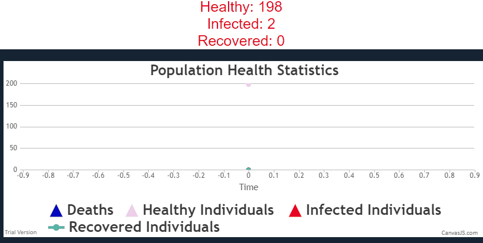
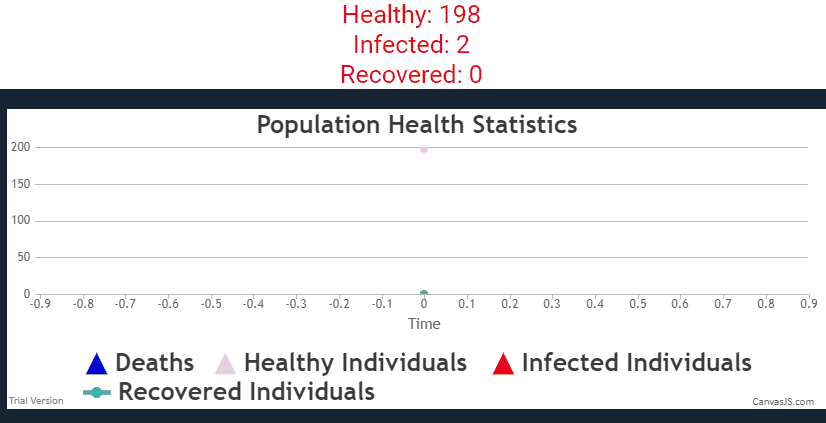
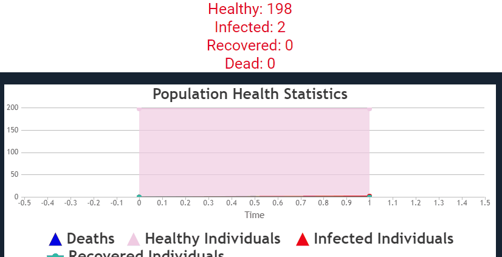

# coronaJS
---

## Javascript gets infected too! :P

## Live Demo: http://tiny.cc/1oaglz
This is an attempt to, not answer, but validate the answers, to current common questions:
- Why should we adopt "social distancing"? Is it actually useful?
- Why are the countries with older populations at a greater risk?

Disclaimer:
This is an extension of an idea presented in the Washington Post, for the sole purpose of killing time productively!
(pseudo-productively)

---

We take a population of 200 individuals.
### Scenario A: No Social Distancing

### Scenario B: Social Distancing

More social distancing keeps even more people healthy. Extensive measures for reducing social and professional contact among people can be one of those simple measures to reduce the number of "red dots" on the map.

## Getting more towards reality!
The above simulations miss a major part of the problem.
The fatalities.
As we look deeper, the problems creep up. The current approx. mortality rate is at a mere 0.2%. Huh? 
That increases to a much more problematic number for the people with age above 60yrs  →14%.

We model two societies, young and old. We use a mortality rate of 1% for the young population and 14% for the older population.

Number of deaths is low for a younger populationThe number of deaths is way higher.
With a 14% mortality rate for just 25% of the total population, it becomes fatal for about 30% of the entire population.

This is exactly, the problems, why countries like Italy are at the forefront of this huge issue. A larger number of cases and deaths mean lesser time for redressal of the issues.

---

Credits:
1. Harry Stevens' article on Washington Post
2. Colliding Particles in Canvas by Thodoris Tsiridis
